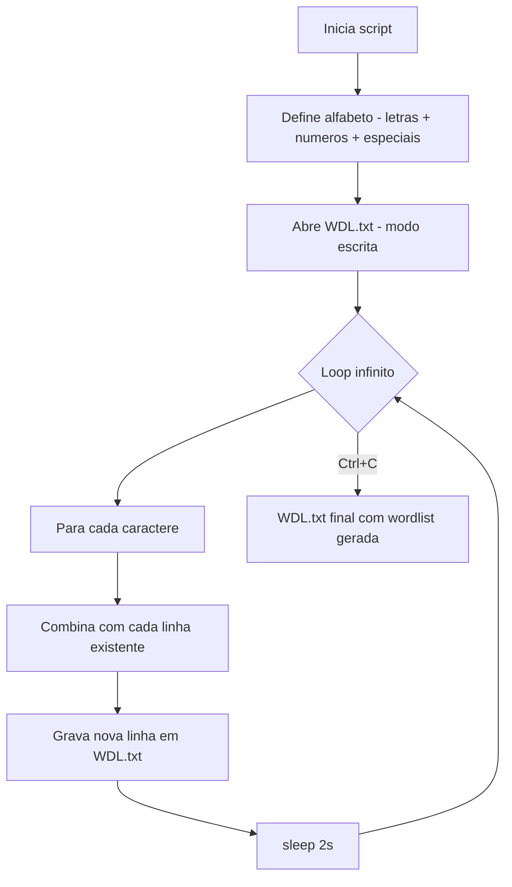

# 📝 WorldListGenerator — Gerador de Wordlists Combinais

<p align="center">
  
  <a href="https://github.com/panda12332145/WorldListGenerator/commits/main"></a>
  <a href="https://github.com/panda12332145/WorldListGenerator"></a>
  
  
</p>

---

## ⚠️ Importante

> **Uso exclusivamente educacional.** Wordlists são usadas em **testes de força bruta autorizados** (laboratórios próprios, CTFs, auditorias com permissão). O uso contra sistemas de terceiros **é crime**. O gerador também tem limitação prática: a explosão combinatoria cresce exponencialmente e o script roda em **loop infinito** por design.

---

## 🔖 Resumo

**WorldListGenerator** é um script Python que gera continuamente combinações de caracteres (letras, números e especiais) e as grava em `WDL.txt` — uma wordlist "viva" que cresce enquanto roda. Ótimo para entender explosão combinatoria, geração de candidatos e o funcionamento por trás de dicionários usados em pentest.

### ✨ Funcionalidades Principais

- ✅ **Geração contínua** — loop infinito que expande combinações a cada ciclo
- ✅ **Alfabeto completo** — `a–z`, `A–Z`, `0–9` e caracteres especiais
- ✅ **Saída em arquivo** — tudo gravado em `WDL.txt`
- ✅ **Configuração simples** — lista de caracteres e delay ajustáveis no topo do script
- ✅ **Sem dependências** — Python puro (stdlib)

---

## 📽 Demonstração

```text
$ python3 "Gerador de WorldList.py"

Gerando Combinações no WDL.txt...
Detecção de Malware por Assinatura... Em Breve...

# WDL.txt (crescendo):
a
b
c
...
aa
ba
ca
...
aab
bab
cab
...
```

---

## ⚙️ Explicação das Partes Importantes

### Alfabeto (`Gerador de WorldList.py`)
```python
letras = list('abcdefghijklmnopqrstuvwxyzABCDEFGHIJKLMNOPQRSTUVWXYZ')
numeros = list('0123456789')
especiais = list('!@#$%&*+-=?_')  # extendável
caracteres = letras + numeros + especiais
```
> Conjunto de símbolos usados para montar cada candidato.

### Loop gerador
```python
arquivo = open('WDL.txt', 'w', encoding='utf-8')
while True:
    # expande: combina cada caractere com as linhas já existentes
    for c in caracteres:
        for linha in linhas_atuais:
            arquivo.write(c + linha + '\n')
    linhas_atuais = ler_linhas('WDL.txt')
    time.sleep(2)   # pausa entre ciclos
```
> A cada iteração o arquivo é recombinado com o alfabeto, dobrando/triplicando o espaço de busca. `sleep(2)` evita I/O saturante.

### Por que loop infinito?
O espaço de combinações é **infinito** — o script nunca "termina", ele vai preenchendo `WDL.txt` até você interromper (Ctrl+C).

---

## 🔄 Fluxo de Trabalho / Arquitetura



---

## 📂 Estrutura do Projeto

```plaintext
WorldListGenerator/
├── Gerador de WorldList.py   # 🧠 Script principal (gerador)
├── WDL.txt                   # 📄 Saída (wordlist gerada)
├── LICENSE                   # 📜 MIT
└── README.md
```

---

## 🛠️ Tecnologias

| Ferramenta | Uso |
|---|---|
| **Python 3** | Linguagem (sem dependências externas) |
| `time` | Pausa entre ciclos de geração |
| Arquivos de texto | Saída em `WDL.txt` |

---

## ▶️ Instalação

```bash
git clone https://github.com/panda12332145/WorldListGenerator.git
cd WorldListGenerator
```

---

## 🚀 Execução

```bash
python3 "Gerador de WorldList.py"
# interrompa com Ctrl+C quando quiser parar
# o resultado fica em WDL.txt
```

**Dicas:**

- Edite `caracteres` no script para alfabetos menores/maiores
- Reduza `time.sleep(2)` para gerar mais rápido (cuidado com I/O)
- Para wordlists direcionadas, misture a saída com `sort -u` e filtre por tamanho:

```bash
sort -u WDL.txt | awk 'length($0)>=6 && length($0)<=10' > filtrada.txt
```

---

## 🧪 Testes

1. Rode o script por ~10 segundos e confira que `WDL.txt` está crescendo
2. Verifique que as primeiras linhas são caracteres individuais
3. Após um minuto, confirme combinações de 2–3 caracteres

---

## ⚠️ Limitações

- **Explosão combinatoria** — o arquivo cresce exponencialmente e pode ocupar muito disco
- Sem geração por máscara (`?l?d?a` estilo hashcat) — seria um bom roadmap
- Sem deduplicação/sort em memória
- Loop infinito por design — não tem estado "concluído"

---

## 🚀 Roadmap

- [x] Gerador básico com alfabeto completo
- [ ] Suporte a máscaras (`pass?0?0?0`)
- [ ] Modo finito (gerar até comprimento N)
- [ ] Deduplicação com `set` em memória
- [ ] Exportação para formatos hashcat/john

---

## 📄 Licença

MIT License — veja [`LICENSE`](LICENSE).

---

## 👾 Autor

<p align="center">
  
</p>

<p align="center">Feito por <strong>Panda12332145</strong> 👋🏽</p>

---

## 🧑‍💻 Sobre Mim

Sou apaixonado por **Física Teórica, Cibersegurança e Desenvolvimento de Sistemas**. Tenho grande interesse em programação de baixo nível, engenharia reversa, automação, sistemas Windows, criptografia e segurança ofensiva. Também gosto bastante de música, filosofia e computação avançada.

---

## 🌐 Redes

* **Site:** [https://panda-h0me.netlify.app/](https://panda-h0me.netlify.app/)
* **YouTube:** [https://www.youtube.com/@X86BinaryGhost](https://www.youtube.com/@X86BinaryGhost)
* **Instagram:** [https://www.instagram.com/01pandal10/](https://www.instagram.com/01pandal10/)
* **GitHub:** [https://github.com/panda12332145](https://github.com/panda12332145)
* **LinkedIn:** [linkedin.com/in/athos-da-boanergis](https://www.linkedin.com/in/athos-d%C3%A3-boanergis-5585a4288/)

---

## 🚀 Áreas de Interesse

* **Cibersegurança Avançada** 🔒
* **Hacking & Engenharia Reversa** 💻
* **Computação de Baixo Nível** 🖥️
* **Matemática e Física Teórica** 📐⚛️
* **Desenvolvimento de Ferramentas de Segurança** 🛠️

_"Conhecimento é poder, e domínio técnico vem da compreensão profunda dos sistemas."_

---

## 📞 Contato & Suporte

Para colaborações, dúvidas ou sugestões:

📧 **E-mail:** [athos.cybersec@gmail.com](mailto:athos.cybersec@gmail.com)

🐛 **Reportar Bug:** [Abrir Issue](https://github.com/panda12332145/WorldListGenerator/issues)

💡 **Sugerir Melhoria:** [Discussions](https://github.com/panda12332145/WorldListGenerator/discussions)
